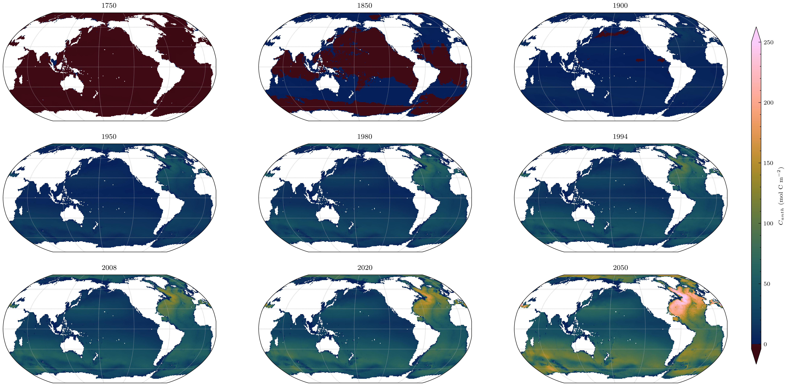

# Tracer-based Rapid Anthropogenic Carbon Estimation (TRACE)

 

**TRACE estimates ocean anthropogenic carbon (Canth)** from user-supplied coordinates, salinity, temperature, and year. It implements the inverse gaussian transit time distribution (IG-TTD) method to increase accessibility, repeatability, and speed of Canth estimation.

**TRACE is available for [Python](https://github.com/d-sandborn/TRACE) and [MATLAB](https://github.com/BRCScienceProducts/TRACEv1),** and is one of a family of ocean state estimation routines, developed in parallel with [ESPER](https://github.com/BRCScienceProducts/ESPER) and [PyESPER](https://github.com/LarissaMDias/PyESPER). Users seeking estimates of present-day TA, DIC, pH, phosphate, nitrate, silicate, or oxygen should use (Py)ESPER. 

**TRACE is designed to be easy to [install](https://d-sandborn.github.io/TRACE/#setup) and [use](https://d-sandborn.github.io/TRACE/trace_howto/)** in your scientific workflow, but that doesn't mean it actually is easy (yet). We welcome feedback and [contributions](https://d-sandborn.github.io/TRACE/contributing/)!

**TRACE is an evolving product** which will incorporate new hydrographic observations and parameterizations as they become available to improve its estimates. Check out the [version history](https://d-sandborn.github.io/TRACE/versions/) for more information. 

*Below: Column inventory of Canth mapped for indicated years produced via TRACE analysis of the GLODAPv2.2016b gridded product assuming historical atmospheric CO2 trajectory.*

## Setup

**Ready to use TRACE? [Installation instructions here!](https://d-sandborn.github.io/TRACE/setup/)**

## Citation

If you use TRACE in your work, please consider citing ours. 

A publication describing the Python implementation of TRACE is presently in review:

!!! note "TRACE-Python manuscript" 

    Sandborn, D.E., Carter, B. R., Warner, M. J., & Dias, L. M. TRACE-Python: Tracer-based Rapid Anthropogenic Carbon Estimation Implemented in Python (version 1.0). In review.

To cite the Python implementation of TRACE:

!!! note "TRACE-Python software" 

    Sandborn, D. E., Barrett, R., & Carter, B. R. (2025). d-sandborn/TRACE: Tracer-based Rapid Anthropogenic Carbon Estimation (TRACE) (v1.0.0). Zenodo. https://doi.org/10.5281/zenodo.17822675

A paper describing TRACEv1 is freely available:

!!! note "TRACEv1 manuscript" 

    Carter, B. R., Schwinger, J., Sonnerup, R., Fassbender, A. J., Sharp, J. D., Dias, L. M., & Sandborn, D. E. (2025). Tracer-based rapid anthropogenic carbon estimation (TRACE). Earth System Science Data, 17(6), 3073–3088. https://doi.org/10.5194/essd-17-3073-2025

To cite the original TRACEv1 software:

!!! note "TRACEv1 software" 

    Carter, B. R. (2025). BRCScienceProducts/TRACEv1: TRACEv1_publication. Zenodo. https://doi.org/10.5281/zenodo.15692788

## Disclaimer

The material embodied in this software is provided to you "as-is" and without warranty of any kind, express, implied or otherwise, including without limitation, any warranty of fitness for a particular purpose. In no event shall the authors be liable to you or anyone else for any direct, special, incidental, indirect or consequential damages of any kind, or any damages whatsoever, including without limitation, loss of profit, loss of use, savings or revenue, or the claims of third parties, whether or not the authors have been advised of the possibility of such loss, however caused and on any theory of liability, arising out of or in connection with the possession, use or performance of this software.
