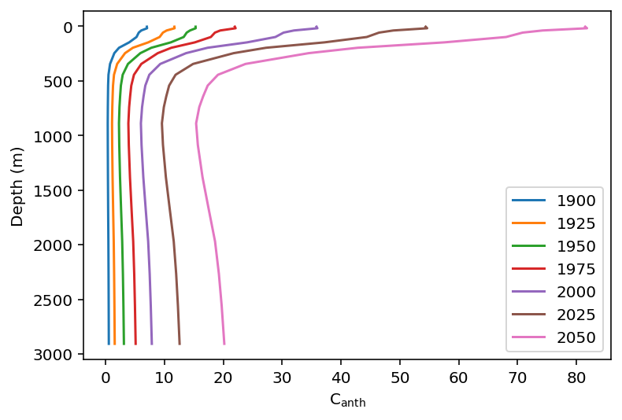
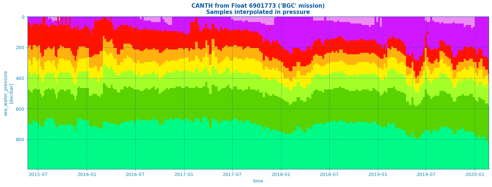

# Cast and profile estimates

We've seen how point estimates of C<sub>anth</sub> may be obtained in a single line of code using `trace`. Scaling this to CTD and Argo casts is a straightforward extension. Vectors representing the cast coordinates, depths, and times may be provided as arguments. This method has utility in comparing the relative rates of C<sub>anth</sub> accumulation at different depths over dimensions of space and time. 

## Hydrographic casts over time

For a first example, the changing distribution of C<sub>anth</sub> over time is illustrated for a simulated series of casts in the Southern Ocean at X S X W, corresponding to the southernmost station of the 2015 reoccupation of the GO-SHIP A16 line. Bottle salinity and CTD temperature from that occupation are used for each re-estimation, neglecting the potentially important effects of changing ocean heat distribution. 

```python

a16s = xr.open_dataset(
    "/home/des/Insync/dsandborntahoe@gmail.com/Google Drive/Python_stuff/PyTRACE/TRACE/demos/33RO20131223_bottle.nc"
)
n = len(a16s.N_LEVELS)
station = a16s.N_PROF[-1].data

df = pd.DataFrame(
    {
        "lat": np.full(n, a16s.latitude[-1]),
        "lon": np.full(n, a16s.longitude[-1]),
        "pressure": a16s.pressure[-1, :].data,
        "sal": a16s.bottle_salinity[-1, :].data,
        "temp": a16s.ctd_temperature.data[-1, :],
    }
)

df["depth"] = dpth(df.pressure, df.lat)  # pressure to depth


years = [1900,1925,1950,1975,2000,2025,2050]
fix, ax = plt.subplots()
for i in years:
    df[f"canth_{i}"] = trace(
        output_coordinates=df[["lon", "lat", "depth"]].to_numpy(),
        dates=np.full(n, i),
        predictor_measurements=df[["sal", "temp"]].to_numpy(),
        predictor_types=np.array([1, 2]),
        atm_co2_trajectory=5,
        verbose_tf=True,
    ).canth.data
    ax.plot(df[f"canth_{i}"], df.depth, label = f"{i}")
ax.invert_yaxis()
ax.set(xlabel = r"C$_{\text{anth}}$", ylabel = "Depth (m)")
ax.legend()

```



Two notable phenomena are evident in the profiles above: C<sub>anth</sub> invasion of the thermocline deepens over time, while the increasing presence of deep water-associated C<sub>anth</sub>increases the slope of the profile in the 1000 - 2000 m depth range. 

## Argo casts over space

Next, a series of salinity and temperature profiles produced by a BGC-Argo float are used to depict the changing profile of C<sub>anth</sub> over the float's path. The resulting description of C<sub>anth</sub> distribution represents an accessible, verified, and scalable method of examining the changing ocean carbon cycle using deplyed instruments including (but not limited to) Argo floats. 

```python
# Code for accessing/plotting adapted from Argopy examples
# https://nbviewer.org/github/euroargodev/argopy/blob/master/docs/examples/BGC_one_float_data.ipynb

from argopy import DataFetcher  
from argopy.plot import scatter_plot
import argopy
argopy.set_options(cachedir="cache_bgc")
argopy.reset_options()
argopy.clear_cache()

import numpy as np
from matplotlib import pyplot as plt
import xarray as xr

xr.set_options(display_expand_attrs=False)
WMO = 6901773
f = DataFetcher(ds="bgc", mode="expert", params="all").float(WMO).load()
ds = f.data

ds = ds.assign(DEPTH=dpth(ds.PRES.data, ds.LATITUDE.data))

output = trace(
    output_coordinates=np.stack(
        [ds["LONGITUDE"].values, ds["LATITUDE"].values, ds["DEPTH"].values],
        axis=1,
    ),
    dates=ds.TIME.dt.decimal_year.data,
    predictor_measurements=np.stack(
        [ds["PSAL"].values, ds["TEMP"].values], axis=1
    ),
    predictor_types=np.array([1, 2]),
)

ds = ds.assign(CANTH=(["N_POINTS"], output.canth.data))


dsp = ds.argo.point2profile()
std_lev = np.arange(0.0, 1000.0, 10.0)
dsi = dsp.argo.interp_std_levels(std_lev)

param = "CANTH"
vmin, vmax = (0, 105)
fig, ax, _ = scatter_plot(
    dsi, param, y="PRES_INTERPOLATED", vmin=vmin, vmax=vmax
)
ax.set_title(
    "%s from Float %i ('%s' mission)\nSamples interpolated in pressure"
    % (param, WMO, f.mission),
    fontdict={"weight": "bold", "size": 12},
)
```



Once again, the invasion of surface waters by C<sub>anth</sub> is evident, and this signal propagates deeper over the course of the 5-year series of profiles. Together with additional float derived data describing physical circulation and biogeochemistry, TRACE estimation of C<sub>anth</sub> may provide a more comprehensive description of the spatial and temporal distribution of phenomena such as C<sub>anth</sub>-forcing of ocean acidification. 