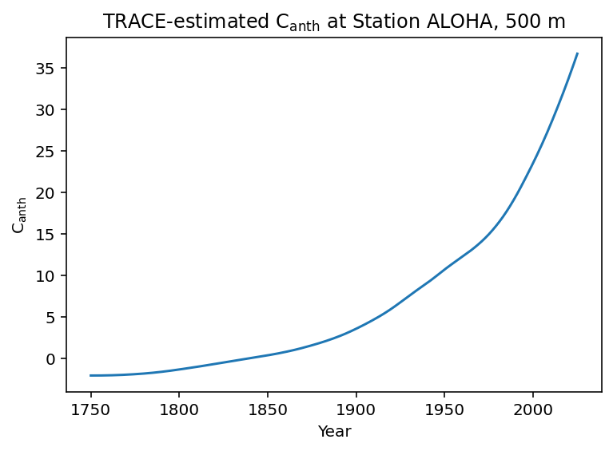

# Time series

Estimating the history of C<sub>anth</sub> over time is straightforward with TRACE, but a couple tricks make it faster and easier, which is important when TRACE estimates are desired beyond individual points and casts. 

## Station ALOHA

Time series generation is demonstrated first for a single point for clarity. Here some reasonable values are defined for a point corresponding to the ALOHA time series at 500 m depth. 

```python
years = np.arange(1750, 2026)
output = trace(
	output_coordinates=np.tile([-158, 22.7, 500], (len(years), 1)),
    dates=years,
    predictor_measurements=np.tile([34,7], (len(years), 1)),
    predictor_types=np.array([1, 2])
)

ax = sns.lineplot(x = years, y = output.canth.data)
ax.set(xlabel='Year', ylabel=r'C$_{\text{anth}}$', title = r'TRACE-estimated C$_{\text{anth}}$ at Station ALOHA, 500 m')
```



Note that input parameters had to be tiled to be the same length as the years of the time series. To avoid ambiguities, broadcasting arrays with unlike dimensions is presently not supported by TRACE. 

## Many points over many times

One of the most significant slowdowns in the C<sub>anth</sub> estimation is the neutral network estimation of preformed properties (TA/Si/P/age scaling) at each point in space. Because these properties are assumed to be time-invariant, this results in the same estimate being made repeatably for ever point in time in the preceding example. Even so, the Station ALOHA estimate ran in a matter of seconds. This begins to be a greater hurdle when the number of re-estimates rises, as may be the case for larger data products such ass salinity and temperature reanalysis fields, model output, and deployed sensor data. Here, the entire GLODAPv2.2023 product is used to supply bottle salinities, CTD temperatures, and coordinates for 1,000 C<sub>anth</sub> estimates repeated for 1,000 time steps over the years 1750-2100, for a total of 1,000,000 estimates. First without reusing any preformed properties:

### The slow way

```python

gd = glodap.world().loc[0:999, :]

years = np.linspace(1750, 2100, 1000)

t1 = time()  # initializing timer
output = trace(
    output_coordinates=np.tile(
        gd[["longitude", "latitude", "depth"]].to_numpy(), (len(years), 1)
    ),
    dates=np.repeat(years, len(gd)),
    predictor_measurements=np.tile(
        gd[["salinity", "temperature"]].to_numpy(), (len(years), 1)
    ),
    predictor_types=np.array([1, 2]),
    atm_co2_trajectory=5,
)
t2 = time()
print(f"Executed in {(t2-t1):.2f}s")

```

The analysis ran in **100.6 seconds** on a consumer-grade laptop. 

### The fast way

The solution to the slow analysis to feed TRACE preformed properties determined for each location for a single time step, then re-run the analysis for all time steps. At the moment, this is implemented as user-accessible inputs: `preformed_ta`, `preformed_si`, `preformed_p`, and `scale_factors`. Take a look at the implementation below, which ran in **53.1 seconds** on the same hardware. 


```python
t1 = time()
pref_props = trace(
    output_coordinates=gd[["longitude", "latitude", "depth"]].to_numpy(),
    dates=np.full(len(gd), years[0]),
    predictor_measurements=gd[["salinity", "temperature"]].to_numpy(),
    predictor_types=np.array([1, 2]),
    atm_co2_trajectory=5,
)

output = trace(
    output_coordinates=np.tile(
        gd[["longitude", "latitude", "depth"]].to_numpy(), (len(years), 1)
    ),
    dates=np.repeat(years, len(gd)),
    predictor_measurements=np.tile(
        gd[["salinity", "temperature"]].to_numpy(), (len(years), 1)
    ),
    predictor_types=np.array([1, 2]),
    atm_co2_trajectory=5,
    preformed_ta=np.tile(pref_props.preformed_ta.data, len(years)),
    preformed_si=np.tile(pref_props.preformed_si.data, len(years)),
    preformed_p=np.tile(pref_props.preformed_p.data, len(years)),
    scale_factors=np.tile(pref_props.scale_factors.data, len(years)),
)
t2 = time()
print(f"Executed in {(t2-t1):.2f}s")
```

