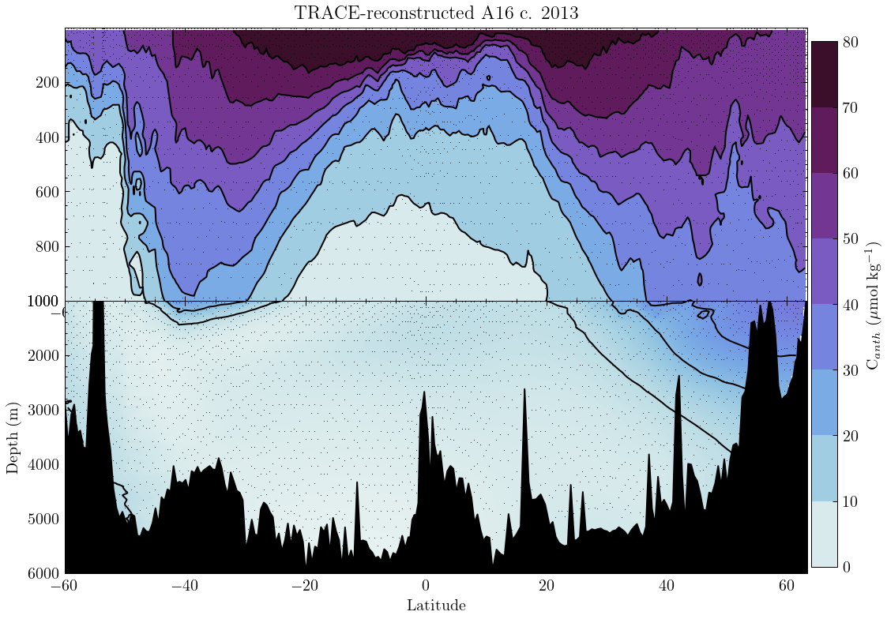

# Transect estimates

Estimates of age and C<sub>anth</sub> may be obtained from an entire transect, as demonstrated here for the GO-SHIP A16 transect, using data from the 2013-2015 reoccupation. Users wishing to replicate this analysis should obtain the NETCDF bottle files from [CCHDO](https://cchdo.ucsd.edu/search?q=group:%22A16%22), or (by modifying the data preparation as in this script) using `*_hy1.csv` files as demonstrated in [the `neutral_density` package](https://github.com/d-sandborn/neutral-density/blob/main/src/neutral_density/transect.py#L59). 

## Input and preparation

Start by importing necessary dependencies. You may need to install some of these in addition to `trace`.

```python
import pandas as pd
import numpy as np
import xarray as xr
from tracepy import trace
from seawater import dpth # deprecated by TEOS-10, should use GSW
import matplotlib.pyplot as plt
import cmocean.cm as cm
from scipy.interpolate import griddata

# optional, needs LaTeX on your machine
import scienceplots
plt.style.use("science")
```

Import datasets containing A16 botle data, then rearrange into a clean Pandas dataframe. We're selecting for QC flag 2, indicating "good" data. 

```python
a16n = xr.open_dataset("path/to/33RO20130803_bottle.nc")
a16s = xr.open_dataset("path/to/33RO20131223_bottle.nc")
combined_length = len(a16n.N_PROF) * len(a16n.N_LEVELS) + len(a16s.N_PROF) * len(
    a16s.N_LEVELS
)
latlist = np.concatenate(
    [
        (
            np.ones((len(a16n.N_PROF), len(a16n.N_LEVELS)))
            * a16n.latitude.data[:, None]
        ).ravel(),
        (
            np.ones((len(a16s.N_PROF), len(a16s.N_LEVELS)))
            * a16s.latitude.data[:, None]
        ).ravel(),
    ]
)
lonlist = np.concatenate(
    [
        (
            np.ones((len(a16n.N_PROF), len(a16n.N_LEVELS)))
            * a16n.longitude.data[:, None]
        ).ravel(),
        (
            np.ones((len(a16s.N_PROF), len(a16s.N_LEVELS)))
            * a16s.longitude.data[:, None]
        ).ravel(),
    ]
)
input_df = pd.DataFrame(
    {
        "lat": latlist,
        "lon": lonlist,
        "pressure": np.concatenate(
            [a16n.pressure.data.ravel(), a16s.pressure.data.ravel()]
        ),
        "year": np.ones((combined_length)) * 2013,
        "sal": np.concatenate(
            [
                a16n.bottle_salinity.where(a16n.bottle_salinity_qc == 2).data.ravel(),
                a16s.bottle_salinity.where(a16s.bottle_salinity_qc == 2).data.ravel(),
            ]
        ),
        "temp": np.concatenate(
            [
                a16n.ctd_temperature.data.ravel(),
                a16s.ctd_temperature.data.ravel(),
            ]
        ),
    }
)
# input_df = input_df.dropna(how="any")
input_df["depth"] = dpth(input_df.pressure, input_df.lat)  # pressure to depth
```

## C<sub>anth</sub> Estimation

Now that the transect has been rearranged into "long" format (i.e. a number of columns of data), these columns can be readily accessed in the required order and converted to the necessary numpy arrays. Inputting the coordinates, salinity, temperature, and times of measurement into `trace`, yielding a CF-compliant xarray dataset containing C<sub>anth</sub> estimates, along with age and associated metadata. 

```python
output = trace(
    output_coordinates=input_df[["lon", "lat", "depth"]].to_numpy(),
    dates=input_df.year.to_numpy(),
    predictor_measurements=input_df[["sal", "temp"]].to_numpy(),
    predictor_types=np.array([1, 2]),
    atm_co2_trajectory=5,
    verbose_tf=True,
)
```

These estimates can be plotted with your section plotting tool of choice, resulting something which looks like:

